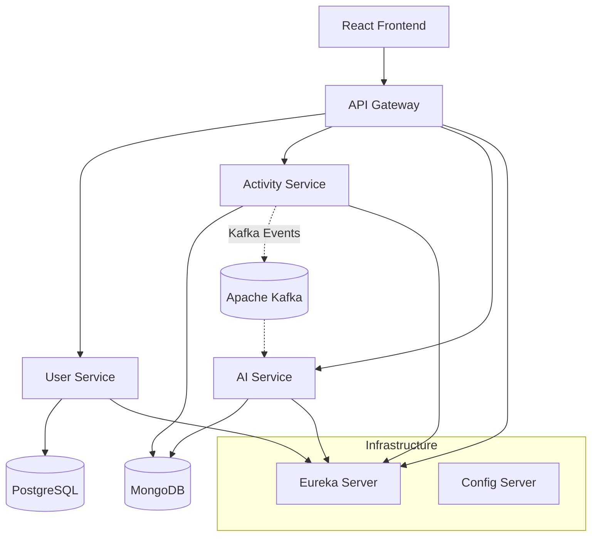

# Fitness App Microservices

A robust, scalable fitness application built using a Microservices architecture with **Spring Boot** and **React** and **Apache Kafka**. This project demonstrates a modern full-stack implementation including service discovery, API gateway, reactive programming, and event-driven communication using Kafka.

## 🏗 Architecture

The system consists of several autonomous microservices communicating via REST and AMQP (RabbitMQ).




## 🛠 Tech Stack

### Backend
*   **Java 23**
*   **Spring Boot 3.4.3**
*   **Spring Cloud 2024.0.0** (Gateway, Eureka, Config)
*   **Databases**: PostgreSQL (User data), MongoDB (Activity & AI data)
*   **Messaging**: Apache Kafka (event-driven communication)
*   **WebFlux**: For reactive non-blocking flows (Activity & AI services)

### Frontend
*   **React 19**
*   **Vite** (Build tool)
*   **Redux Toolkit** (State Management)
*   **Material UI (MUI)** (Component Library)
*   **Axios** (API Client)

## 📦 Service Breakdown

| Service | Port | Description | Tech Details |
| :--- | :--- | :--- | :--- |
| **Config Server** | 8888 | Centralized configuration for all services | Spring Cloud Config |
| **Eureka Server** | 8761 | Service Discovery & Registry | Spring Cloud Netflix Eureka |
| **API Gateway** | 8080 | Entry point, routing, auth validation | Spring Cloud Gateway, OAuth2 |
| **User Service** | 8081 | User management & profiles | JPA, PostgreSQL |
| **Activity Service** | 8082 | Workout analysis & tracking | MongoDB, WebFlux, RabbitMQ |
| **AI Service** | 8083 | AI recommendations via Gemini | MongoDB, WebFlux, RabbitMQ, Gemini |

## 🚀 Getting Started

### Prerequisites

Ensure you have the following installed and running:
*   **Java JDK 23**
*   **Node.js 20+**
*   **PostgreSQL** (Port 5432) - Create DB: `fitness_user_db`
*   **MongoDB** (Port 27017) - Create DBs: `fitnessactivity`, `fitnessrecommendation`
*   **Apache Kafka** Kafka Broker: 9092, Zookeeper: 2181
*   **Keycloak** (Port 8181) - With realm `fitness-oauth2` (Used for Auth/JWT)
*   **Gemini API Key** - Required for AI Service

### Installation & Running

1.  **Clone the repository**
    ```bash
    git clone <repository-url>
    cd fitness-app-microservices
    ```

2.  **Start Infrastructure Services**
    Start these in the following order:
    1.  `configserver`
    2.  `eureka`

3.  **Start Core Backend Services**
    Start `userservice`, `activityservice`, and `aiservice`.
    
    > **Note:** For `ai-service`, ensure you set the `GEMINI_API_KEY` environment variable or update `ai-service.yml` in config server.

    ```bash
    cd <service-name>
    ./mvnw spring-boot:run
    ```

4.  **Start API Gateway**
    ```bash
    cd gateway
    ./mvnw spring-boot:run
    ```

5.  **Start the Frontend**
    ```bash
    cd fitness-app-frontend
    npm install
    npm run dev
    ```

## 🔐 Configuration

*   **Keycloak**: Ensure Keycloak is running at port `8181` and configured with realm `fitness-oauth2`. Update `api-gateway.yml` if your Keycloak URL differs.
*   **Database**: Update `user-service.yml`, `activity-service.yml`, etc. in `configserver/src/main/resources/config` if credentials differ.
*   **AI Service**: Needs `GEMINI_API_URL` and `GEMINI_API_KEY`.

## 🤝 Contribution

Feel free to submit issues and enhancement requests.
